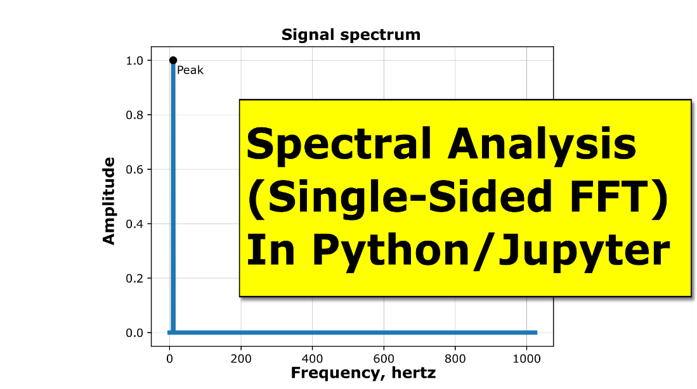

# Shorts

## Project Description

This repository stores the code examples used in the short “how-to” videos
posted on the [RobotSquirrelProductions
website](https://robotsquirrelproductions.com/vibration-data-visualization/) and
[YouTube channel](https://www.youtube.com/channel/UC3F8gIDlvlyzcyVPFT_q5GA). I
plan to update this repository as I release new videos and posts, so check back
for updates.

I have a short description of each project below.

## Spectral Analysis (Single-Sided FFT) with Python and Jupyter

This video provides a short tutorial showing how to calculate and plot a
spectrum (single-sided FFT of a real-valued signal) in Python using a Jupyter
Notebook.

The first half of the video is setting up the time domain signal, and the last
half is the FFT portion.

Click on the image below to see the video.

