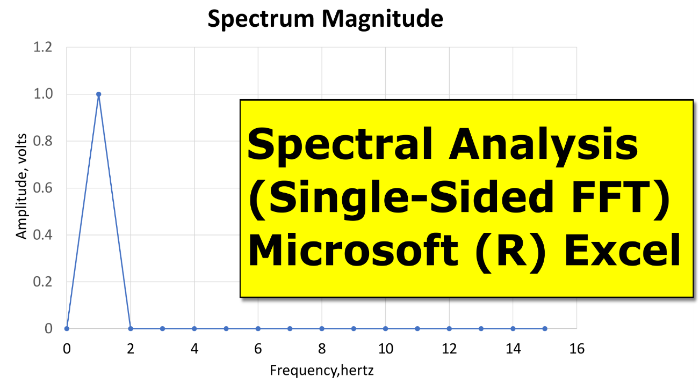
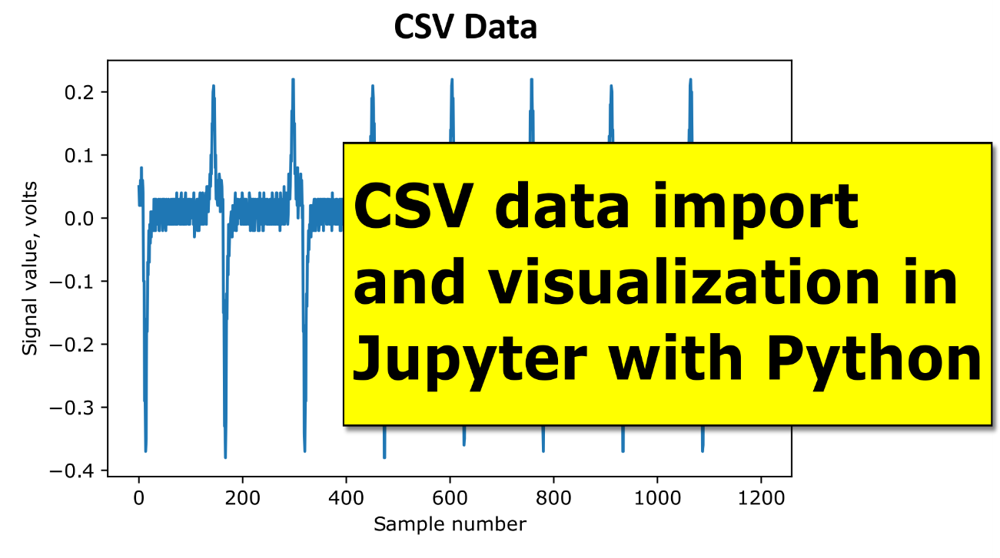
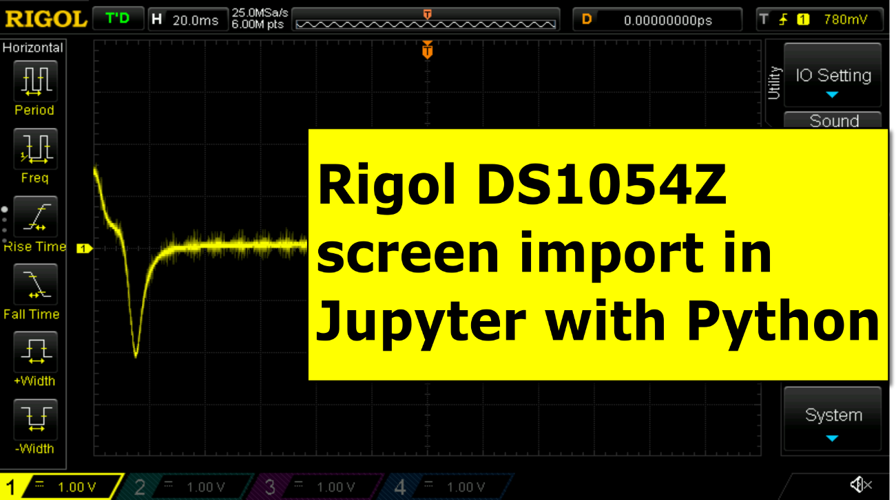
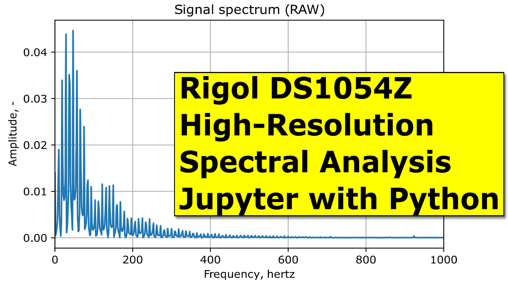
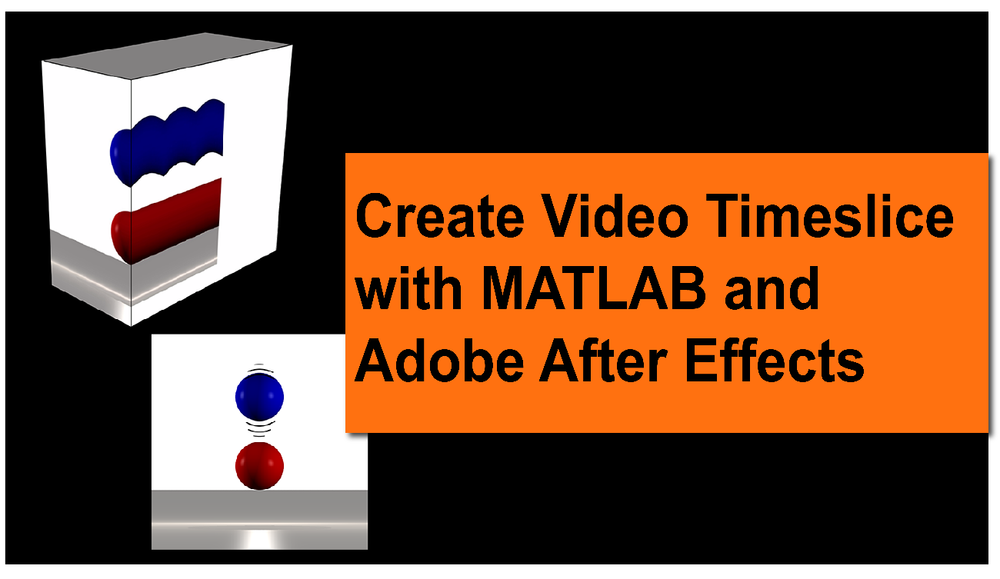
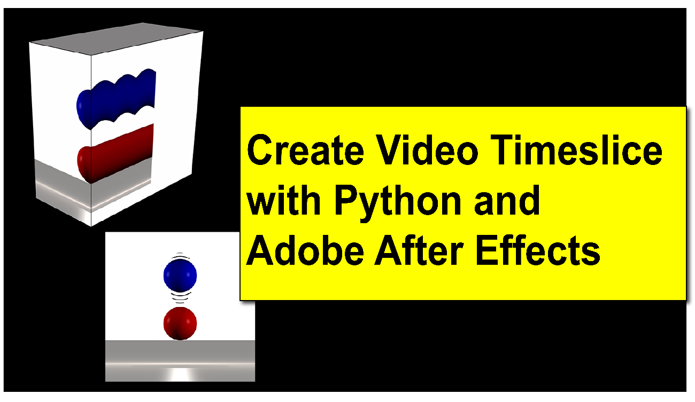
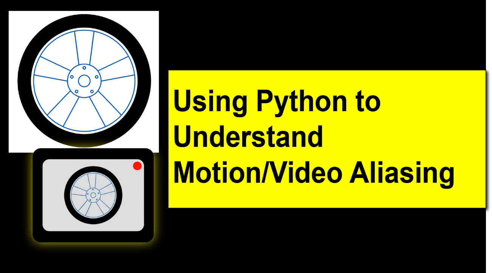

# Shorts

## Project Description

This repository stores the code examples used in the short “how-to” videos
posted on the [RobotSquirrelProductions
website](https://robotsquirrelproductions.com/vibration-data-visualization/) and
[YouTube channel](https://www.youtube.com/channel/UC3F8gIDlvlyzcyVPFT_q5GA). I
plan to update this repository as I release new videos and posts, so check back
for updates.

I have a short description of each project below.

## Spectral Analysis (Single-Sided FFT) with Python and Jupyter

This video provides a short tutorial showing how to calculate and plot a
spectrum (single-sided FFT of a real-valued signal) in Python using a Jupyter
Notebook.

The first half of the video is setting up the time domain signal, and the last
half is the FFT portion.

Click on [this link](https://youtu.be/8KWPlno6VP0) to see the video and
[here](https://robotsquirrelproductions.com/spectral-analysis-in-python/) for
the blog describing the code in more detail.

## Spectral Analysis (Single-Sided FFT) with Microsoft (R) Excel

This video provides a short tutorial showing how to calculate and plot a
spectrum (single-sided FFT of a real-valued signal) in Microsoft (R) Excel. The
intent is to provide a high-level tutorial on calculating an FFT, so the video
skips the math and theoretical background. Please let me know in the comments if
more or less explanation would be helpful.

After completing the FFT calculation, the video shows some of the effects of
spectral leakage and offers a few tips to reduce the problem.

Click [here](https://youtu.be/6wlhY3gTG3g) to view the video.

## How to Plot CSV Data in Python Using Pandas

This tutorial shows how to import a comma-separated values (CSV) file into
Jupyter using Python and visualize the data with the matplotlib library.

Click [here](https://youtu.be/y43_o2OnI68) to view the video and
[here](https://robotsquirrelproductions.com/plotting-csv-data-in-python-with-pandas-and-matplotlib/)
for the blog describing the code in more detail.

## Using Python to Save a Rigol DS1054Z Screenshot

This tutorial shows how to import a bitmap screenshot from the Rigol DS1054Z
oscilloscope into a Jupyter notebook using Python.

Click this [link](https://youtu.be/MnUDdVfZzA4) to view the video.

## High-Resolution Spectral Analysis Using a Rigol D1054Z and Jupyter/Python

This tutorial shows how to import screen-resolution and high-resolution signals
from the Rigol DS1054Z oscilloscope into a Jupyter notebook using Python. The
tutorial also shows how to calculate and plot the single-sided FFT for each
signal type.

Click [here](https://youtu.be/QXV85j5VwBE) to view the video.

## Creating a time slice video in MATLAB and Adobe After Effects

This tutorial teaches you to time slice a video using
[MATLAB](https://www.mathworks.com/products/matlab.html) and [Adobe After
Effects](https://www.adobe.com/products/aftereffects.html) tools to develop an
animation and pixel history (a time slice) through a video. I hope you enjoy it!

Click this [link](https://youtu.be/81fEvIXLIRQ) to view the video. There is also
a tutorial
[here](https://robotsquirrelproductions.com/time-slicing-a-video-using-matlab-and-adobe-after-effects/).

## Creating a time slice video using Python and Adobe After Effects

This tutorial teaches you to time slice a video using
[Python](https://www.python.org/) and [Adobe After
Effects](https://www.adobe.com/products/aftereffects.html) tools to develop an
animation and pixel history (a time slice) through a video. I hope you enjoy it!

Click this [link](https://youtu.be/IuAB1uWeSc8) to view the video. There is also
a tutorial
[here](https://robotsquirrelproductions.com/time-slice-a-video-using-python-and-adobe-after-effects/).

# Using Python to understand motion/video aliasing

This video uses [Python](https://www.python.org/) and to develop an animation
showing how video or motion aliasing can distort your footage.

Click this [link](https://youtu.be/7EJchzREP5M) to view the video. There is a
website with more information
[here](https://robotsquirrelproductions.com/vibration-analysis-terminology/#glossary-aliasing).

